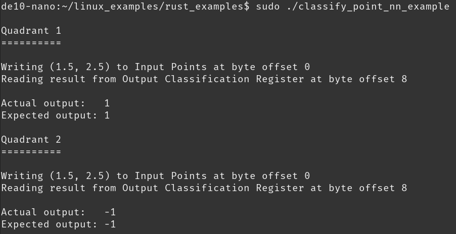

Outline
-------

<!--
TODO: Figure out how to add newline with the presentation URL in the author
      section.
-->

In this talk, we will go through

- Basics of how to implement a neural network using Clash.
- How to make accessing the FPGA safe using Rust.


Architecture
------------

We will be implementing a dense neural network on an Intel Cyclone V chip, which
has both an ARM processor and FPGA on one chip (SoC).


- Low power
- Very high throughput (GPU+ level)
- Deterministic timing


How is a neural network implemented?
------------------------------------

A neural network is usually shown as a series of nodes with connections between
them. But what does that mean?

<!--
TODO: Make our own figure so that we are not copying anyone without permission.
-->


Neural network basics: how to go from one layer to another
----------------------------------------------------------

Going from one layer ($x$) to the next ($y$) is implemented using the equation
$y = g(Mx + b)$.


Neural network basics: how to go from one layer to another
----------------------------------------------------------

Going from one layer ($x$) to the next ($y$) is implemented using the equation
$y = g(Mx + b)$.


Neural network basics: how to go from one layer to another
----------------------------------------------------------

Going from one layer ($x$) to the next ($y$) is implemented using the equation
$y = g(Mx + b)$.


Neural network basics: how to go from one layer to another
----------------------------------------------------------

Going from one layer ($x$) to the next ($y$) is implemented using the equation
$y = g(Mx + b)$.


Neural network basics: how to go from one layer to another
----------------------------------------------------------

Going from one layer ($x$) to the next ($y$) is implemented using the equation
$y = g(Mx + b)$.


Let's implement the linear algebra basics
-----------------------------------------

For the equation $y = g(Mx + b)$, we need to be able to add two vectors
together and perform matrix-vector multiply.

. . .

```haskell
-- Add two vectors: x + y
(<+>) :: (KnownNat n, Num a)
      => Vec n a -> Vec n a -> Vec n a
(<+>) = zipWith (+)
```

Let's implement the linear algebra basics: dot product
------------------------------------------------------

For the equation $y = g(Mx + b)$, we need to be able to add two vectors
together and perform matrix-vector multiply.

```haskell
-- Dot product: ⟨x, y⟩
(<.>) :: (KnownNat n, Num a)
      => Vec n a -> Vec n a -> a
(<.>) xs ys = foldr1 (+) (zipWith (*) xs ys)
```

Compiling just the matrix vector multiply
-----------------------------------------

If we compile just the dot product:

```haskell
(<.>) xs ys = foldr1 (+) (zipWith (*) xs ys)
```

We can see what Clash will generate for a simple case (4 element vector).


Let's implement the linear algebra basics: matrix-vector multiply
-----------------------------------------------------------------

To round out our $y = g(Mx + b)$, we need to know how to do the $Mx$ part! This
is performing the dot product with each row in the matrix.

```haskell
type Matrix m n a = Vec m (Vec n a)

-- Matrix vector multiply: Mx
(#>) :: (KnownNat m, KnownNat n, Num a)
     => Matrix m n a -> Vec n a -> Vec m a
(#>) m v = map (<.> v) m
```


With the basics down, let's define the neural network type
----------------------------------------------------------

Now that we have the basic linear algebra operators down, lets store everything
we need for the $y = g(Mx + b)$.

```haskell
-- Transition of size m to size n
data LayerTransition (m :: Nat) (n :: Nat) a =
  LayerTransition
          { b :: Vec n a      -- Bias b
          , m :: Matrix n m a -- Connections M
          , g :: a -> a       -- Activation function g
          }
```


We can compose layers using a dependently typed list
----------------------------------------------------

Now we will create a list of layers by making a list of `LayerTransition`s.

```haskell
data Network (i :: Nat) (hs :: [Nat]) (o :: Nat) a where
    OutputLayer :: (LayerTransition i o a) -> Network i '[] o a
```

. . .

```haskell
    (:>>) :: (KnownNat i, KnownNat o, KnownNat h)
          => (LayerTransition i h a)
          -> (Network h hs o a)
          -> Network i (h ': hs) o a
```

Running a `LayerTransition`
---------------------------

We can now run a layer transition by applying our equation $y = g(Mx + b)$ to
some input vector $x$ to output vector $y$.

```haskell
runLayer :: (KnownNat i, KnownNat o, Num a)
         => (LayerTransition i o a)
         -> Vec i a
         -> Vec o a
runLayer (LayerTransition b m g) x =
  map g $ m #> x <+> b
-- Precisely y = g(Mx + b) from before!
```

Clash Run Network
-----------------

Now we can run our network by moving data from one layer to the nxt

```haskell
runNet :: (KnownNat i, KnownNat o, Num a, Ord a)
       => Network i hs o a -- ^ Dense neural network
       -> Vec i a -- ^ Input vector
       -> Vec o a -- ^ Result vector
runNet (OutputLayer l) v = runLayer l v
runNet (l :>> n) v = runNet n (runLayer l v)
```


Composing Layers
----------------

Let's suppose we have the following four layer neural network.

```haskell
layer1 :: (Fractional a, Ord a) => Weights 2 3 a
layer2 :: (Fractional a, Ord a) => Weights 3 3 a
layer3 :: (Fractional a, Ord a) => Weights 3 2 a
layer4 :: (Fractional a, Ord a) => Weights 2 1 a
```

. . .

Now combine them using our `Network` type.

```haskell
network :: (Fractional a, Ord a)
        => Network 2 '[3, 3, 2] 1 a
network = layer1 :>> layer2 :>> layer3 :>> OutputLayer layer4
```

The type level numbers force us to make a network where the sizes of the output
of one layer match the input to the next!


Clash Synthesize
----------------

We can now synthesize what we have into something the FPGA can understand using
`clash File.hs --verilog`.

```haskell
topEntity :: Vec 2 (SFixed 7 25) -> Vec 1 (SFixed 7 25)
topEntity = runNet network
```

. . .

Note that

::: incremental

- We had to specify the specific number type we were using. Clash must know this
  to layout the hardware correctly.
- We don't have access to floating point numbers, so we use fixed point numbers
  instead.

:::

Meeting timing constraints
--------------------------

Experienced FPGA developers will notice that networks above a certain size
cannot be synthesized.

. . .

```haskell
fold (+) (zipWith (*) xs ys)
```


Meeting timing constraints
--------------------------

But we can add a register between the zip and the fold to reduce the critical
path.

```haskell
fold (+) $ unbundle $ register (repeat 0) $ zipWith (*) <$> xs <*> *ys)
```


Other benefits to Clash
-----------------------

Blah blah

- Simple to test the base functions (just Haskell! Can use quickcheck)
- State machines are modeled in a convenient form using Mealy machines. Enabled
  pipelining.
- Something else here, ssshhhh it is super secret.


NN actually on the chip
-----------------------

Neural network we actually have on the chip! It runs the whole network _in one
clock cycle_ at 50 MHz (20 ns!)


Rust program to interact with the FPGA
======================================

The Big Picture -- Safe Control of Our FPGA Hardware
----------------------------------------------------


A common paradigm to interact with an FPGA is via a host CPU. We will build a
user-facing `Session` API built on top of memory-mapped file I/O with the FPGA.

Key Concepts
------------

We will build a Rust API and shoot for the following using the type system:

- Encode and enforce HW invariants.
- Push as much as possible to compile-time checks.
- Maintain ergonomics!

Key Concepts
------------

In the end, we want something that looks like this:

```rust
// Get our FPGA session.
let sesh = take_fpga_session();
// Write our 2D point to the FPGA for the computation.
sesh.write(&input_point, (x, y))?;
// Read back the classification from the net.
let quad_classification = sesh.read(&output_class)?;
```

and has compile-time guarantees so we can sleep well at night!

How Do We Get There?
--------------------

We will build a *Session* API using Rust:


The Design
----------

The major components of our Session API:

1. Express application-specific resources (*e.g.*, registers).
2. The session that wraps the FPGA and all interaction with it.
3. Link these together in a way that is ergonomic and type safe.

{ width=320 }

Generically Modeling FPGA Resources with Traits and Typestates
--------------------------------------------------------------

Traits are one of the anchors of the Rust type system. They allow you to define
shared behavior and constraints for sets of types.

They are similar to typeclasses in Haskell, interfaces in Java, and traits in
Scala.

Encoding the Data Type/Primitive with a Trait
---------------------------------------------

```rust
/// Trait for FPGA data types.
pub trait Data: Sized {
    fn from_le_bytes(bytes: &[u8]) -> FpgaApiResult<Self>;
    fn from_be_bytes(bytes: &[u8]) -> FpgaApiResult<Self>;
    fn to_le_bytes(self) -> Vec<u8>;
    fn to_be_bytes(self) -> Vec<u8>;
}
```

`Data` is implemented for primitives (*e.g.*, `u32`, `f32`, etc.). To plug into
the `Session` API with a custom data type, just implement `Data`!

Controlling Read/Write with a Typestate
---------------------------------------

Typestates are a great way to encode invariants in the type system. There is no
runtime cost and if it compiles, the encoded invariants are guaranteed.


*Note*: The common `Builder` pattern in Rust is a form of the latter.

Encoding Resource Allowed I/O with Typestates in Rust
-----------------------------------------------------

```Rust
/// Typestate pattern via empty marker trait.
pub trait IOState {}
/// Uninhabitable `enum` for first typestate.
pub enum ReadOnly {}
impl IOState for ReadOnly {}
/// Uninhabitable `enum` for second typestate.
pub enum ReadWrite {}
impl IOState for ReadWrite {}
```

Putting These Together: Expressing Any FPGA Resource
-----------------------------------------------------

```rust
pub struct Resource<D: Data, I: IOState> {
    name: &'static str,
    offset: usize,
    _ty: PhantomData<D>,
    _st: PhantomData<I>,
}
```

For any resource, only a `name` and a (byte) `offset` are reified at runtime.
The `D` and `I` typestates determine the available operations associated with
the FPGA (through the `Session`).

What Does This Give Us?
-----------------------

In application code:

1. (In a type sense) we can't send the wrong bytes to the FPGA or interpret incoming bytes incorrectly.
2. We can't mutate a read-only FPGA resource.

```Rust
let sesh = take_fpga_session();
let input_point = Resource::<(I7F25, I7F25), ReadWrite>::new(...);
let output_class = Resource::<I7F25, ReadOnly>::new(...);
// -- snip -- Note: `I7F25` is a "fixed point" numeric type.
let (x, y): (f32, f32) = (1.3, -2.7);
sesh.write(&input_point, (x, y))?;                // Comp fail (type).
let v: u32 = sesh.read(&output_class)?;           // Comp fail (type).
sesh.write(&output_class, I7F25::from_num(1.0))?; // Comp fail (R-only).
```

Now, to the `Session` Type
--------------------------

The opaque `Session` type represents the FPGA and our interaction with it.

We will encode the singular nature of the HW and the importance of maintaining appropriate
state with the help of the type system.

Encode `Session` HW Invariant: Singleton
----------------------------------------

We can't let our devs arbitrarily spawn up or duplicate sessions (there's only
1 piece of HW). We use Rust's version of the singleton pattern for this:

```rust
struct Fpga(Option<MmapSesh>);
impl Fpga {
    fn take(&mut self) -> MmapSesh {
        let sesh = self.0.take();
        sesh.expect("Forbidden to create more than one FPGA session!")
    }
}
pub fn take_fpga_session() -> MmapSesh {
    POINT_NN_FPGA.lock().unwrap().take()
}
// -- snip -- in application code
let mut sesh = take_fpga_session();
```

Encode `Session` HW Invariant: Initialization and Finalization
--------------------------------------------------------------

Rust's RAII and affine type system allows us to ensure FPGA/HW state invariants:

- Can only create a `Session` through constructor that performs proper initialization.
- \textcolor[rgb]{0,0.5,0}{Must implement `Drop` to finalize state of the FPGA (and any associated HW) when we're done.}
- \textcolor[rgb]{0,0.5,0}{You cannot then forget to `Drop` -- in happy or sad code paths!}

Encode `Session` HW Invariant: Initialization
---------------------------------------------

```rust
impl MmapSession {
    // The only way to get an instance of our `Session` type.
    pub fn new(mmap: MmapMut) -> FpgaApiResult<Self> {
        let mut sesh = Self { mmap };
        sesh.initialize()?; // HW initialization here.
        Ok(sesh)
    }
}
```

Encode `Session` HW Invariant: Finalization
-------------------------------------------

```rust
pub trait Session: Drop { // Note **must** implement `Drop`.
// -- snip --
impl Drop for MmapSesh {
    fn drop(&mut self) {
        // Enforce critical FPGA/HW invariants for "final" state.
        // -- snip --
    }
}
```

What Does This Give Us?
-----------------------

With `Drop` implemented, we cannot "forget" to cleanup the FPGA and associated resources:

```Rust
fn main() {
    let sesh = take_fpga_session();
    // -- snip -- do stuff with the FPGA.
    risky_function().expect("Uh oh, hit a panic!");
    // -- snip -- more stuff
    println!("Done!");
}
```

Whether we `panic` or not, our session will be `Drop`ped.

Bringing It All Together in the Session: Helper Traits
------------------------------------------------------

```rust
pub trait Readable {
    type Value: Data;
    fn byte_offset(&self) -> usize;
    fn size_in_bytes(&self) -> usize;
}
pub trait Writable {
    type Value: Data;
    fn byte_offset(&self) -> usize;
    fn size_in_bytes(&self) -> usize;
}
impl<D: Data> Readable for Resource<D, ReadOnly> {  // ...
impl<D: Data> Readable for Resource<D, ReadWrite> { // ...
impl<D: Data> Writable for Resource<D, ReadWrite> { // ...
```

Bringing It All Together: The `Session` Trait
---------------------------------------------

:::::::::::::: {.columns}
::: {.column width="49%"}

```rust
pub trait Session: Drop {

    fn read<R: Readable>(
        &self,
        resource: &R
    ) -> FpgaApiResult<R::Value>;

    fn write<R: Writable>(
        &mut self,
        resource: &R,
        val: R::Value
    ) -> FpgaApiResult<()>
}
```

:::
::: {.column width="49%"}

- We have a simple and ergonomic API with just `read` and `write` but have wired
up traits, constraints, and typestates so that a lot is enforced at compile-time.
- The Rust compiler will *monomorphize* concrete `read` and `write` functions
based on what resources are defined and used in a given application.

:::
::::::::::::::

Implementing `Session` for Memory-Mapped File I/O
-------------------------------------------------

```rust
impl Session for MmapSesh {
    fn read<R: Readable>(
        &self,
        resource: &R
    ) -> FpgaApiResult<R::Value>
    {
        let start = resource.byte_offset();
        let stop = start + resource.size_in_bytes();
        let slc = &self.mmap[start..stop];
        R::Value::from_le_bytes(slc)
    }
    // -- snip --
```

Implementing `Session` for Memory-Mapped FPGA I/O
-------------------------------------------------
```rust
    // -- snip --
    fn write<R: Writable>(
        &mut self,
        resource: &R,
        val: R::Value
    ) -> FpgaApiResult<()>
    {
        let start = resource.byte_offset();
        let stop = start + resource.size_in_bytes();
        self.mmap[start..stop].copy_from_slice(
            val.to_le_bytes().as_slice()
        );
        Ok(())
    }
```

Point Quadrant Classifier: Visualization of Solution
----------------------------------------------------


Point Quadrant Classifier: The Code
-----------------------------------

```rust
fn run() -> FpgaApiResult<()> {
    // Get the FPGA singleton. Better not try and do this more than once!
    let mut sesh = take_fpga_session();
    // Define the resources.
    let input_point = Resource::<(I7F25, I7F25), ReadWrite>::new(
        "Input Point Registers(X, Y)",
        POINT_NN_INPUT_VECTOR_OFFSET,
    );
    let output_class = Resource::<I7F25, ReadOnly>::new(
        "Output Classification Register",
        POINT_NN_OUTPUT_CLASS_OFFSET,
    );
    let (pos_x, neg_x) = (I7F25::from_num(1.5), I7F25::from_num(-1.5));
    let (pos_y, neg_y) = (I7F25::from_num(2.5), I7F25::from_num(-2.5));
    // -- snip --
```

Point Quadrant Classifier: The Code
-----------------------------------
```rust
    // -- snip --
    // Quadrant 1.
    sesh.write(&input_point, (pos_x, pos_y))?;
    let q1_actual = sesh.read(&output_class)?;
    let q1_expected = I7F25::from_num(1.0);
    // -- snip --
    // Quadrant 2.
    sesh.write(&input_point, (neg_x, pos_y))?;
    let q2_actual = sesh.read(&output_class)?;
    let q2_expected = I7F25::from_num(-1.0);
    // -- snip --
}
```

Point Quadrant Classifier: Output Running on Board
--------------------------------------------------



Conclusion
----------

We are awesome.

Questions?
----------

Insert cute animal here
