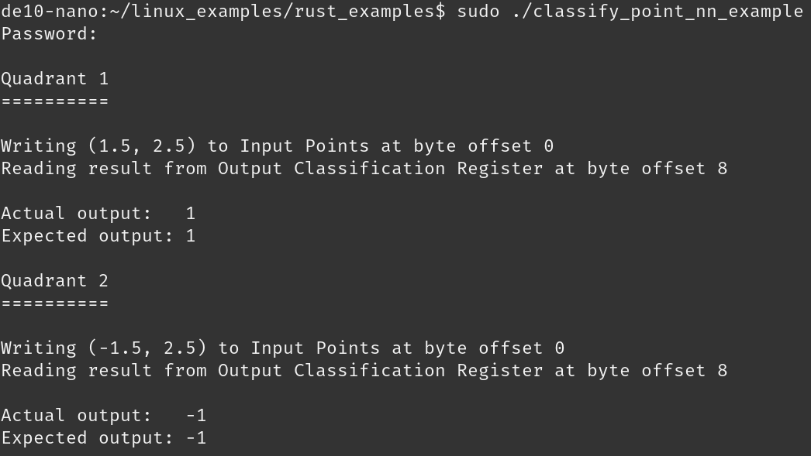

Outline
-------

<!--
TODO: Figure out how to add newline with the presentation URL in the author
      section.
-->

In this talk, we will go through

- Forward propagation for neural networks.
- How to implement forward propagation using Clash on an FPGA.
- How to make accessing the FPGA safely using Rust.


Architecture
------------

We will implement a neural network _as hardware_ on a Cyclone V chip.

\smallnspace


Implementing algorithms in hardware has several advantages:

\undovspacepause

- Low power
- High throughput (GPU-like or better)
- Deterministic timing


How is a neural network implemented?
------------------------------------

A neural network is usually shown as a series of nodes with connections between
them [^1]. But what does that mean?

<!--
TODO: Make our own figure so that we are not copying anyone without permission.
-->


[^1]: https://www.kdnuggets.com/2019/11/designing-neural-networks.html


Neural network basics: how to go from one layer to another
----------------------------------------------------------

Going from one layer ($x$) to the next ($y$) is implemented using the equation
$y = g(Mx + b)$.


Neural network basics: how to go from one layer to another
----------------------------------------------------------

Going from one layer ($x$) to the next ($y$) is implemented using the equation
$y = g(Mx + b)$.


Neural network basics: how to go from one layer to another
----------------------------------------------------------

Going from one layer ($x$) to the next ($y$) is implemented using the equation
$y = g(Mx + b)$.


Neural network basics: how to go from one layer to another
----------------------------------------------------------

Going from one layer ($x$) to the next ($y$) is implemented using the equation
$y = g(Mx + b)$.


Neural network basics: how to go from one layer to another
----------------------------------------------------------

Going from one layer ($x$) to the next ($y$) is implemented using the equation
$y = g(Mx + b)$.


Let's implement the linear algebra basics
-----------------------------------------

For the equation $y = g(Mx + b)$, we need to be able to add two vectors
together and perform matrix-vector multiply.

. . .

```haskell
-- Add two vectors: x + y
(<+>) :: (KnownNat n, Num a)
      => Vec n a -> Vec n a -> Vec n a
(<+>) = zipWith (+)
```

Let's implement the linear algebra basics: dot product
------------------------------------------------------

For the equation $y = g(Mx + b)$, we need to be able to add two vectors
together and perform matrix-vector multiply.

```haskell
-- Dot product: ⟨x, y⟩
(<.>) :: (KnownNat n, Num a)
      => Vec n a -> Vec n a -> a
(<.>) xs ys = foldr1 (+) (zipWith (*) xs ys)
```

Compiling just the matrix vector multiply
-----------------------------------------

If we compile just the dot product with 4 element vectors filled with `Int` :

```haskell
(<.>) xs ys = foldr1 (+) (zipWith (*) xs ys)
```


Let's implement the linear algebra basics: matrix-vector multiply
-----------------------------------------------------------------

To round out our $y = g(Mx + b)$, we need to know how to do the $Mx$ part! This
is performing the dot product with each row in the matrix.

```haskell
type Matrix m n a = Vec m (Vec n a)

-- Matrix vector multiply: Mx
(#>) :: (KnownNat m, KnownNat n, Num a)
     => Matrix m n a -> Vec n a -> Vec m a
(#>) m x = map (<.> x) m
```


Encoding the layer as a type called `LayerTransition`
-----------------------------------------------------

Now that we have the basic linear algebra operators down, lets store everything
we need for the $y = g(Mx + b)$.

```haskell
-- Transition of size m to size n
data LayerTransition (i :: Nat) (o :: Nat) a =
  LayerTransition
          { m :: Matrix o i a -- Connections M
          , b :: Vec o a      -- Bias b
          , g :: a -> a       -- Activation function g
          }
```


We can compose layers using a dependently typed list called `Network`
---------------------------------------------------------------------

Now we will create a non-empty list of `LayerTransition`s using a GADT[^2].

```haskell
data Network (i :: Nat) (hs :: [Nat]) (o :: Nat) a where
```

. . .

```haskell
    OutputLayer :: (LayerTransition i o a) -> Network i '[] o a
```

. . .

```haskell
    (:>>) :: (KnownNat i, KnownNat o, KnownNat h)
          => (LayerTransition i h a)
          -> (Network h hs o a)
          -> Network i (h ': hs) o a
```

[^2]: Inspired by [Justin Le's](https://blog.jle.im/entry/practical-dependent-types-in-haskell-1.html) dependent type NN structure.

Using `runLayer` to move from one layer in the NN to the next
-------------------------------------------------------------

We can now run a layer transition by applying our equation $y = g(Mx + b)$ to
some input vector $x$ to output vector $y$.

```haskell
runLayer :: (KnownNat i, KnownNat o, Num a)
         => (LayerTransition i o a)
         -> Vec i a -- Input nodes
         -> Vec o a -- Output nodes
runLayer (LayerTransition m b g) x =
  map g $ m #> x <+> b
-- Precisely y = g(Mx + b) from before!
```


`runNet` is a fold that allows us to process all the layers
-----------------------------------------------------------

Now we can run our network by moving data from one layer to the next.

```haskell
runNet :: (KnownNat i, KnownNat o, Num a, Ord a)
       => Network i hs o a -- ^ Dense neural network
       -> Vec i a -- ^ Input vector
       -> Vec o a -- ^ Result vector
```

. . .

```haskell
runNet (OutputLayer l) v = runLayer l v
```

. . .

```haskell
runNet (l :>> n) v = runNet n (runLayer l v)
```


Layers can be composed using `:>>`, only with matching layer sizes!
-------------------------------------------------------------------

Let's suppose we have the following four layer neural network.

```haskell
layer1 :: (Fractional a, Ord a) => Weights 2 3 a
layer2 :: (Fractional a, Ord a) => Weights 3 3 a
layer3 :: (Fractional a, Ord a) => Weights 3 2 a
layer4 :: (Fractional a, Ord a) => Weights 2 1 a
```

. . .

Now combine them using our `Network` type.

```haskell
network :: (Fractional a, Ord a)
        => Network 2 '[3, 3, 2] 1 a
network = layer1 :>> layer2 :>> layer3 :>> OutputLayer layer4
```

The type level numbers force us to make a network where the sizes of the output
of one layer match the input to the next!


Synthesizing FPGA hardware
--------------------------

We can now synthesize what we have into something the FPGA can understand using
`clash File.hs --verilog`.

```haskell
topEntity :: Vec 2 (SFixed 7 25) -> Vec 1 (SFixed 7 25)
topEntity = runNet network
```

. . .

Note that

::: incremental

- We had to specify the specific number type we were using. Clash must know this
  to layout the hardware correctly.
- We had to specify which type of number we are using in order to synthesize the
  hardware.

:::


Meeting timing constraints
--------------------------

Experienced FPGA developers will notice that networks above a certain size
cannot be synthesized.

. . .

```haskell
fold (+) (zipWith (*) xs ys)
```


Meeting timing constraints
--------------------------

But we can add a register between the zip and the fold to reduce the critical
path.

```haskell
fold (+) $ unbundle $ register (repeat 0) $ zipWith (*) <$> xs <*> *ys)
```


Other benefits to Clash
-----------------------

Since Clash is mostly just Haskell, you get a ton of benefits.

- Strong (dependently typed!) type system.
- Complicated FPGA state can be modeled with a Mealy machine, which is
  basically just `StateT`!
- `Applicative`, `Monad`, etc can be used to create convenient abstractions.
- The base functions can be tested like any other Haskell function (Quickcheck!)
- Resulting hardware can be simulated down to the picosecond using Clash and
  other tools.


Quadrant detection neural network that Rust will interact with
--------------------------------------------------------------

Neural network we actually have on the chip! It runs the whole network _in one
clock cycle_ at 50 MHz (20 ns!)


Rust program to interact with the FPGA
======================================


The Big Picture -- Safe Control of Our FPGA Hardware
----------------------------------------------------


A common paradigm to interact with an FPGA is via a host CPU. We will build a
user-facing `Session` API built on top of memory-mapped file I/O with the FPGA.

Key Concepts
------------

In our API, we will shoot for the following using Rust's type system:

- Encode and enforce HW invariants.
- Push as much as possible to compile-time checks.
- Maintain ergonomics!

Key Concepts
------------

In the end, we want something that looks like this:

```rust
// Get our FPGA session.
let sesh = take_fpga_session();
// Write our 2D point to the FPGA for the computation.
sesh.write(&input_point, (x, y))?;
// Read back the classification from the net.
let quad_classification = sesh.read(&output_class)?;
```

and has compile-time guarantees so we can sleep well at night!

How Do We Get There?
--------------------

We will build a *Session* API using Rust:


The Design
----------

The major components of our Session API:

1. Express application-specific resources (*e.g.*, registers).
2. The session that wraps the FPGA and all interaction with it.
3. Link these together with the type system in a way that is ergonomic.

{ width=320 }

Generically Modeling FPGA Resources with Traits and Typestates
--------------------------------------------------------------

Traits are one of the anchors of the Rust type system. They allow you to define
shared behavior and constraints for sets of types.

They are similar to typeclasses in Haskell, interfaces in Java, and traits in
Scala.

Encoding the Data Type/Primitive with a Trait
---------------------------------------------

```rust
/// Trait for FPGA data types.
pub trait Data: Sized {
    fn from_le_bytes(bytes: &[u8]) -> FpgaApiResult<Self>;
    fn from_be_bytes(bytes: &[u8]) -> FpgaApiResult<Self>;
    fn to_le_bytes(self) -> Vec<u8>;
    fn to_be_bytes(self) -> Vec<u8>;
}
```

`Data` is implemented for primitives (*e.g.*, `u32`, `f32`, etc.). To plug into
the `Session` API with a custom data type, just implement `Data`!

Controlling Read/Write with a Typestate
---------------------------------------

Typestates are a great way to encode invariants in the type system. There is no
runtime cost and if it compiles, the encoded invariants are guaranteed.


*Note*: The common `Builder` pattern in Rust is a form of the latter.

Encoding Resource Allowed I/O with Typestates in Rust
-----------------------------------------------------

```Rust
/// Typestate pattern via empty marker trait.
pub trait IOState {}
/// Uninhabitable `enum` for first typestate.
pub enum ReadOnly {}
impl IOState for ReadOnly {}
/// Uninhabitable `enum` for second typestate.
pub enum ReadWrite {}
impl IOState for ReadWrite {}
```

Putting These Together: Expressing Any FPGA Resource
-----------------------------------------------------

```rust
pub struct Resource<D: Data, I: IOState> {
    name: &'static str,
    offset: usize,
    _ty: PhantomData<D>,
    _st: PhantomData<I>,
}
```

For any resource, only a `name` and a (byte) `offset` are reified at runtime.
The `D` and `I` typestates determine the available operations associated with
the FPGA (through the `Session`).

What Does This Give Us?
-----------------------

In application code:

1. (In a type sense) we can't send the wrong bytes to the FPGA or interpret incoming bytes incorrectly.
2. We can't mutate a read-only FPGA resource.

```Rust
let sesh = take_fpga_session();
let input_point = Resource::<(I7F25, I7F25), ReadWrite>::new(...);
let output_class = Resource::<I7F25, ReadOnly>::new(...);
// -- snip -- Note: `I7F25` is a "fixed point" numeric type.
let (x, y): (f32, f32) = (1.3, -2.7);
sesh.write(&input_point, (x, y))?;                // Comp fail (type).
let v: u32 = sesh.read(&output_class)?;           // Comp fail (type).
sesh.write(&output_class, I7F25::from_num(1.0))?; // Comp fail (R-only).
```

Now, to the `Session` Type
--------------------------

The opaque `Session` type represents the FPGA and our interaction with it.

We will encode the singular nature of the HW and the importance of maintaining appropriate
state with the help of the type system.

Encode `Session` HW Invariant: Singleton
----------------------------------------

We can't let our devs arbitrarily spawn up or duplicate sessions (there's only
1 piece of HW). We use Rust's version of the singleton pattern for this:

```rust
struct Fpga(Option<MmapSesh>);
impl Fpga {
    fn take(&mut self) -> MmapSesh {
        let sesh = self.0.take();
        sesh.expect("Forbidden to create more than one FPGA session!")
    }
}
pub fn take_fpga_session() -> MmapSesh {
    POINT_NN_FPGA.lock().unwrap().take()
}
// -- snip -- in application code
let mut sesh = take_fpga_session();
```

Encode `Session` HW Invariant: Initialization and Finalization
--------------------------------------------------------------

Rust's RAII and affine type system allows us to ensure FPGA/HW state invariants:

- Can only create a `Session` through constructor that performs proper initialization.
- \textcolor[rgb]{0,0.5,0}{Must implement `Drop` to finalize state of the FPGA (and any associated HW) when we're done.}
- \textcolor[rgb]{0,0.5,0}{You cannot then forget to `Drop` -- in happy or sad code paths!}

Encode `Session` HW Invariant: Finalization
-------------------------------------------

```rust
pub trait Session: Drop { // Note **must** implement `Drop`.
// -- snip --
impl Session for MmapSesh {
// -- snip --
impl Drop for MmapSesh {
    fn drop(&mut self) { // You never have to manually call this.
        // Enforce critical FPGA/HW invariants for "final" state.
        // -- snip --
    }
}
```

What Does This Give Us?
-----------------------

With `Drop` implemented, we cannot "forget" to cleanup the FPGA and associated resources:

```Rust
fn main() {
    let sesh = take_fpga_session();
    // -- snip -- do stuff with the FPGA.
    risky_function().expect("Uh oh, hit a panic!");
    // -- snip -- more stuff
    println!("Done!");
}
```

Whether we `panic` or not, our session will be `Drop`ped and our FPGA/HW will
be in the appropriate state.

Bringing It All Together in the Session: Helper Traits
------------------------------------------------------

```rust
pub trait Readable { // A readable FPGA resource.
    type Value: Data;
    fn byte_offset(&self) -> usize;
    fn size_in_bytes(&self) -> usize;
}
pub trait Writable { // A writable FPGA resource.
    type Value: Data;
    fn byte_offset(&self) -> usize;
    fn size_in_bytes(&self) -> usize;
}
impl<D: Data> Readable for Resource<D, ReadOnly> {  // ...
impl<D: Data> Readable for Resource<D, ReadWrite> { // ...
impl<D: Data> Writable for Resource<D, ReadWrite> { // ...
```

Bringing It All Together: The `Session` Trait
---------------------------------------------

:::::::::::::: {.columns}
::: {.column width="49%"}

```rust
pub trait Session: Drop {

    fn read<R: Readable>(
        &self,
        resource: &R
    ) -> FpgaApiResult<R::Value>;

    fn write<R: Writable>(
        &mut self,
        resource: &R,
        val: R::Value
    ) -> FpgaApiResult<()>
}
```

:::
::: {.column width="49%"}

- We have a simple and ergonomic API with just `read` and `write` but have wired
up traits, constraints, and typestates so that a lot is enforced at compile-time.
- The Rust compiler will *monomorphize* concrete `read` and `write` functions
based on what resources are defined and used in a given application.

:::
::::::::::::::

Implementing `Session` for Memory-Mapped File I/O
-------------------------------------------------

```rust
impl Session for MmapSesh {
    fn read<R: Readable>(
        &self,
        resource: &R
    ) -> FpgaApiResult<R::Value>
    {
        let start = resource.byte_offset();
        let stop = start + resource.size_in_bytes();
        let slc = &self.mmap[start..stop];
        R::Value::from_le_bytes(slc)
    }
    // -- snip --
```


Implementing `Session` for Memory-Mapped FPGA I/O
-------------------------------------------------

```rust
    // -- snip --
    fn write<R: Writable>(
        &mut self,
        resource: &R,
        val: R::Value
    ) -> FpgaApiResult<()>
    {
        let start = resource.byte_offset();
        let stop = start + resource.size_in_bytes();
        self.mmap[start..stop].copy_from_slice(
            val.to_le_bytes().as_slice()
        );
        Ok(())
    }
```

Point Quadrant Classifier: Visualization of Solution
----------------------------------------------------


Point Quadrant Classifier: The Code
-----------------------------------

```rust
fn run() -> FpgaApiResult<()> {
    // Get the FPGA singleton. Better not try and do this more than once!
    let mut sesh = take_fpga_session();
    // Define the resources.
    let input_point = Resource::<(I7F25, I7F25), ReadWrite>::new(
        "Input Point Registers(X, Y)",
        POINT_NN_INPUT_VECTOR_OFFSET,
    );
    let output_class = Resource::<I7F25, ReadOnly>::new(
        "Output Classification Register",
        POINT_NN_OUTPUT_CLASS_OFFSET,
    );
    let (pos_x, neg_x) = (I7F25::from_num(1.5), I7F25::from_num(-1.5));
    let (pos_y, neg_y) = (I7F25::from_num(2.5), I7F25::from_num(-2.5));
    // -- snip --
```

Point Quadrant Classifier: The Code
-----------------------------------

```rust
    // -- snip --
    // Quadrant 1.
    sesh.write(&input_point, (pos_x, pos_y))?;
    let q1_actual = sesh.read(&output_class)?;
    let q1_expected = I7F25::from_num(1.0);
    // -- snip --
    // Quadrant 2.
    sesh.write(&input_point, (neg_x, pos_y))?;
    let q2_actual = sesh.read(&output_class)?;
    let q2_expected = I7F25::from_num(-1.0);
    // -- snip --
}
```

Point Quadrant Classifier: Output Running on Board
--------------------------------------------------



Conclusion
----------

We are awesome.


Questions?
----------

Our slides and the code to do this yourself can be found at:

https://github.com/ryanorendorff/sbtb-2020-type-safe-fpga

<figure>{ style="width: 70%; margin: auto;" }</figure>
